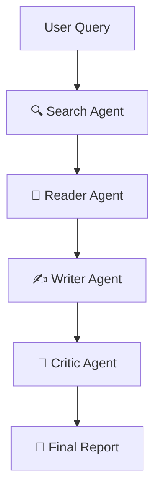
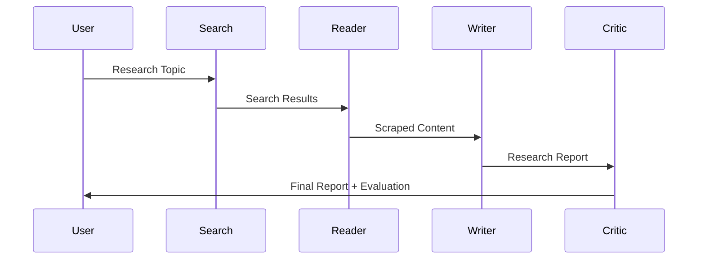

<div align="center">

# 🌌 ResearchGuru

### Autonomous Multi-Agent AI Research System

<p>
An AI-powered research assistant that searches the web, extracts reliable information, generates structured reports, and critiques its own work using a collaborative multi-agent architecture.
</p>

<p>


</p>


</div>

<p align="center">
  <b>Search • Read • Write • Critique</b><br>
  Autonomous AI agents collaborate to produce structured research reports from live web data.
</p>

<p align="center">

<a href="https://multi-agent-system-ey8zonmppqsnv7hyonczdq.streamlit.app/">

</a>

<a href="https://drive.google.com/file/d/1qnFun0cw6HRI-p06StwpBoU05nh-7iic/view?usp=sharing">

</a>

<a href="https://github.com/adityaxgoswami/multi-agent-system">

</a>

</p>

## 📑 Table of Contents

- [📖 Project Overview](#-project-overview)
- [🎯 Motivation](#-motivation)
- [🎯 Why Multi-Agent?](#-why-multi-agent)
- [🚀 Key Highlights](#-key-highlights)
- [🏗️ System Architecture](#-system-architecture)
- [🤝 Agent Collaboration](#-agent-collaboration)
- [🤖 Agent Workflow](#-agent-workflow)
- [🖥️ User Interface](#-user-interface)
- [📂 Project Structure](#-project-structure)
- [⚙️ Pipeline Components](#-pipeline-components)
- [🚀 Installation](#-installation)
- [🔑 Environment Variables](#-environment-variables)
- [▶️ Run the Application](#-run-the-application)
- [📸 Screenshots](#-screenshots)
- [📄 Sample Report](#-sample-report)
- [🔥 Future Improvements](#-future-improvements)
- [🚧 Challenges & Learnings](#-challenges--learnings)
- [🧠 Concepts Demonstrated](#-concepts-demonstrated)
- [📈 Why this Project?](#-why-this-project)
- [🤝 Contributing](#-contributing)
- [⭐ Support](#-support)
- [👨‍💻 About the Author](#-about-the-author)
---
# 📖 Project Overview

ResearchGuru is an **Autonomous Multi-Agent AI Research System** that automates the entire research workflow using specialized AI agents.

Instead of relying on a single Large Language Model to perform every task, ResearchGuru divides the research process into multiple intelligent agents, each responsible for a specific objective. This modular design improves scalability, maintainability, and produces more structured and reliable research outputs.

Starting from a simple research query, the system performs:

- 🔍 Web search to gather recent and relevant information
- 📄 Deep content extraction from trusted sources
- ✍️ AI-generated structured research reports
- 🧐 Automated quality evaluation and feedback

The entire pipeline is orchestrated using **LangChain Agents**, powered by **Hugging Face LLMs**, and presented through an interactive **Streamlit** interface.

---

## 🎯 Motivation

Modern LLMs are powerful, but asking a single model to search, read, summarize, organize, and evaluate information often produces inconsistent or hallucinated responses.

ResearchGuru addresses this limitation by adopting a **multi-agent architecture**, where each AI agent specializes in a single responsibility.

This approach mirrors how human research teams collaborate:

- One researcher gathers information.
- Another performs in-depth reading.
- A technical writer prepares the report.
- A reviewer evaluates its quality.

By separating these responsibilities, the system produces more organized, transparent, and extensible research workflows.

---
# 🎯 Why Multi-Agent?

Traditional LLM applications rely on a single model to perform every task, making workflows harder to scale, debug, and maintain.

ResearchGuru adopts a **multi-agent architecture**, where each AI agent specializes in a specific responsibility. This modular approach improves maintainability, extensibility, and produces more structured research outputs.

| Traditional LLM | ResearchGuru |
|-----------------|--------------|
| One model handles every task | Specialized AI agents collaborate |
| Difficult to debug | Independent agent outputs |
| Hard to extend | Modular architecture |
| Mixed responsibilities | Clear separation of concerns |
| Less scalable | Enterprise-ready design |
---
## 🚀 Key Highlights

- 🤖 Multi-Agent AI Architecture
- 🔍 Automated Web Research
- 🌐 Intelligent Web Scraping
- ✍️ Structured Report Generation
- 🧐 AI-Based Report Evaluation
- 📥 Markdown Report Export
- 🎨 Modern Streamlit Dashboard
- ⚡ Modular & Easily Extensible Design
---

# 🏗️ System Architecture



---

# 🤝 Agent Collaboration



# 🤖 Agent Workflow

## 1️⃣ Search Agent

Uses DuckDuckGo Search to collect relevant and recent information from the internet.

**Responsibilities**

- Search latest information
- Find reliable sources
- Return search summaries

---

## 2️⃣ Reader Agent

Chooses the best source and scrapes detailed information using BeautifulSoup.

**Responsibilities**

- Extract webpage content
- Remove unnecessary HTML
- Clean textual information

---

## 3️⃣ Writer Agent

Uses the gathered research to generate a professional report.

The generated report includes:

- Introduction
- Key Findings
- Detailed Explanation
- Conclusion
- Sources

---

## 4️⃣ Critic Agent

Acts as an AI reviewer.

It evaluates:

- Report quality
- Completeness
- Missing information
- Final Score
- Suggestions for improvement

---

# 🖥️ User Interface

The project includes a modern Streamlit interface featuring

- Beautiful Dark Theme
- Animated Agent Pipeline
- Real-time Progress
- Download Report Button
- Research History View
- Raw Search Logs
- Critic Feedback Panel

---

# 📂 Project Structure

```bash
ResearchGuru/
│
├── agent.py             # Agent creation
├── tools.py             # Search & Scraping tools
├── pipeline.py          # CLI Pipeline
├── app.py               # Streamlit UI
│
├── requirements.txt
├── .env
└── README.md
```

---

# ⚙️ Pipeline Components

| Component | Technology |
|-----------|------------|
| **Programming Language** | Python 3.11 |
| **LLM** | Qwen2.5-7B-Instruct |
| **Agent Framework** | LangChain |
| **Search Engine** | DuckDuckGo Search |
| **Web Scraping** | BeautifulSoup |
| **Frontend** | Streamlit |
| **Prompt Templates** | ChatPromptTemplate |
| **Output Parsing** | StrOutputParser |
| **Environment Management** | python-dotenv |

# 🚀 Installation

Clone the repository

```bash
git clone https://github.com/yourusername/ResearchGuru.git

cd ResearchGuru
```

Install dependencies

```bash
pip install -r requirements.txt
```

---

# 🔑 Environment Variables

Create a `.env` file.

```env
HUGGINGFACE_API_KEY=your_api_key
```

---

# ▶️ Run the Application

### Streamlit UI

```bash
streamlit run app.py
```

### Command Line Version

```bash
python pipeline.py
```

---

# 📸 Screenshots

| Home | Agent Workflow |
|------|----------------|
|  |  |

| Generated Report | Critic Feedback |
|------------------|-----------------|
|  |  |

---

# 📄 Sample Report

**Topic**

```
Future of Quantum Computing
```

**Generated Sections**

- Introduction
- Key Findings
- Conclusion
- Sources

**Critic Evaluation**

```
Score: 9.4/10

Strengths:
- Well-structured report
- Reliable sources
- Clear explanations

Areas to Improve:
- Include more quantitative comparisons.
```
---
# 🔥 Future Improvements

- PDF Report Export

- Citation Generation

- Multi-source Verification

- Memory Enabled Agents

- Local LLM Support

- RAG Integration

- Parallel Agent Execution

- Vector Database

- Source Ranking

- Multi-language Reports

- Research History Database
---
# 🚧 Challenges & Learnings

## Challenges

- Designing a modular multi-agent workflow.
- Coordinating information flow between specialized agents.
- Engineering prompts for different agent roles.
- Extracting reliable content from webpages.
- Structuring research reports consistently.

## Key Learnings

- Multi-Agent AI Systems
- LangChain Agent Framework
- Prompt Engineering
- Tool Calling
- Web Scraping
- Streamlit Development
- Modular AI Architecture
---
# 🧠 Concepts Demonstrated

- Multi-Agent Systems

- Agent Orchestration

- Prompt Engineering

- Web Search

- Web Scraping

- LLM Chains

- AI Evaluation

- Report Generation

- Streamlit Development

- Modular Software Design

---

# 📈 Why this Project?

Unlike traditional chatbots, ResearchGuru follows a collaborative AI architecture where multiple specialized agents solve different parts of the research process.

This makes the system more modular, scalable, and closer to real-world AI agent workflows used in modern enterprise applications.

---

# 🤝 Contributing

Contributions are welcome!

1. Fork the repository

2. Create a feature branch

3. Commit your changes

4. Push to your branch

5. Open a Pull Request

---

# ⭐ Support

If you found this project useful,

⭐ Star this repository

🍴 Fork it

📢 Share it with others

---
---

# 👨‍💻 About the Author

<div align="center">


## Aditya Goswami

**Computer Science Undergraduate | Machine Learning Engineer | Generative AI Enthusiast**

Passionate about building intelligent systems using Machine Learning, Large Language Models, RAG, and Multi-Agent AI architectures. I enjoy solving real-world problems through scalable AI applications and continuously exploring emerging technologies in the AI ecosystem.

<p align="center">

<a href="https://github.com/adityaxgoswami">

</a>

<a href="https://www.linkedin.com/in/adityaxgoswami/">

</a>

<a href="mailto:adityagoswami2424@gmail.com">

</a>

</p>

---

<div align="center">

⭐ **If you found this project useful, consider giving it a star!**

Built with ❤️ by **Aditya Goswami**

</div>
